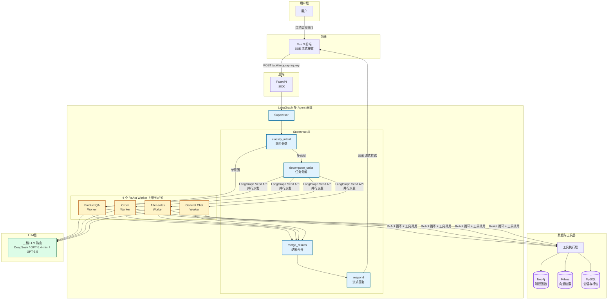

# 🛍️ 灵犀智购 — 多 Agent 智能客服系统

> **基于 LangGraph Supervisor + 4 ReAct Worker 的电商客服系统** — 意图分类 → 并行派发 → 工具自治 → SSE 流式回复，配套 Vue 3 前端 + JWT 登录 + 分段式记忆。

[](https://www.python.org/)
[](https://vuejs.org/)
[](https://github.com/langchain-ai/langgraph)
[](https://fastapi.tiangolo.com/)
[](./LICENSE)

> **当前分支**: `feat/multi-agent`(已重构为多 Agent 架构,旧版单图设计已废弃)

## ✨ 项目亮点

- **Supervisor + 4 ReAct Worker 并行架构**：多意图请求并发处理，实测端到端延迟降低约 **40%**（3-Worker 场景）
- **三档 LLM 智能路由**：高成本模型仅承载约 **20%** 调用，其余分流至低成本档位
- **工具命中率 87.1%** + 多轮上下文路由准确率 **85%**（三层量化评测体系 + LLM-as-Judge）
- **结构化反馈机制**：Worker 可主动上报 `clarify / 转发 / 升级`，配合转发计数防止死循环，实现误分类自愈
- **分段式记忆隔离**：彻底解决跨 Worker 槽位污染问题，上下文准确性显著提升

---

## 📋 目录

- [项目简介](#-项目简介)
- [系统架构](#%EF%B8%8F-系统架构)
- [核心特性](#-核心特性)
- [技术栈](#%EF%B8%8F-技术栈)
- [快速开始](#-快速开始)
- [项目结构](#-项目结构)
- [核心模块](#-核心模块)
- [License](#-license)

---

## 🎯 项目简介

本项目是一个**面向消费电子场景的多 Agent 智能客服系统**。Supervisor 节点先分类意图,再用 LangGraph 的 `Send` API 并行派发任务给 4 个 ReAct Worker(产品咨询/订单查询/售后处理/闲聊),每个 Worker 在固定工具集内循环推理,最后由 Supervisor 合成回复并 SSE 流式输出。

**这个项目能展示什么?**

- ✅ **多 Agent 并行生产实践**：Supervisor + 4 ReAct Worker 真实并行调度，端到端延迟降低约 40%
- ✅ **三档 LLM 智能路由**：按任务难度动态分配模型，高成本模型仅占约 20% 调用
- ✅ **结构化反馈与自愈机制**：Worker 主动上报控制信号，实现误分类自动转发与升级
- ✅ **分段式记忆隔离**：彻底解决跨 Worker 上下文污染问题
- ✅ **三层量化评测**：意图路由准确率 + Worker 工具命中率（87.1%） + 最终回答质量（LLM-as-Judge）

---

## 🏗️ 系统架构

### 整体流程



> **提示**：GitHub 会自动渲染 Mermaid 图。如果你本地看不到，可以使用 [mermaid.live](https://mermaid.live) 预览。

### 请求流转

```
① 用户:"对比一下小米15和iPhone16,我预算5000"
        ↓
② classify_intent → 识别为单意图 product_qa,重写 query 带预算约束
        ↓
③ Send dispatch → product_qa Worker 启动
        ↓
④ ReAct loop: semantic_search → compare_products → 组答案
        ↓
⑤ merge_results:confidence ≥ 0.5 且非 fallback → fast-path 直接透传
        ↓
⑥ respond:token-by-token SSE 流式输出
```

---

## ✨ 核心特性

### 1. Supervisor + 4 Worker 并行编排（延迟降低 40%）

**核心价值**：多意图场景下实现真正的并发处理，而非串行等待。实测在 3 个 Worker 并行场景下，端到端延迟从 sum 降低为 max，降幅约 40%。

| 节点 | 职责 | LLM 档位 |
|------|------|----------|
| `classify_intent` | 把用户消息分到 1-N 个 Worker + 重写 query | flash |
| `decompose_tasks` | 多 Worker 场景拆成 `SubTask[]` | flash |
| `Send dispatch` | LangGraph `Send` API 并行启动 Worker 子图 | — |
| `merge_results` | 合并多 Worker 结果(fast-path / LLM 合成两条路径) | flash |
| `respond` | token 流式输出 `final_answer` | flash |

### 2. 三档 LLM 路由（成本优化）

**核心价值**：高成本模型仅承载约 20% 的调用，其余请求自动分流至低成本模型，在保持效果的同时显著降低推理成本。

| Tier | 模型 | 用在 | 选它的理由 |
|------|------|------|-----------|
| `flash` | DeepSeek `deepseek-chat` | classify / decompose / merge / general_chat | 中文强、便宜、弱工具调用足够 |
| `tool` | GPT-5.4 Mini (aihubmix) | product_qa / order_qa | 工具调用最稳,多步 ReAct 不漂 |
| `reason` | GPT-5.5 (aihubmix) | after_sales | 退换货/赔付要推理 + 同理心 |

### 3. 结构化反馈机制

每个 Worker 通过工具返回值向 Supervisor 上报结构化控制信号，支持：
- **clarify**（澄清）：信息不足时主动追问用户
- **转发**（reroute）：识别到误分类时将请求转给更合适的 Worker
- **升级**（escalate）：超出系统能力时引导升级人工

配合转发计数机制防止死循环，实现了误分类的自愈能力。

### 4. 分段式记忆(v2-lite)

**核心价值**：彻底解决跨 Worker 槽位污染问题。v1 版本中不同业务 Worker 的上下文会互相污染，导致推荐时带出订单信息等问题。v2 通过 `(segment_id, worker_type)` 二维隔离，实现了真正的上下文洁净。

```
classify_intent 读上下文时分组:
  [order_qa]    {"last_order_id": "1001"}
  [product_qa]  {"products_mentioned": ["iPhone16"]}
  [用户偏好]    {"budget_max": 5000}
  [对话摘要]    "上一段聊了什么"
```

### 5. SSE 流式 + 会话自愈

- 后端 `POST /api/langgraph/query` 用 SSE 推三类事件:`status`(阶段提示)、`data`(token)、`end`(收尾)
- `conversation_id` 在 DB 找不到时自动 INSERT 一条,**解决 localStorage 与 DB 不同步**(如 DB 重置后浏览器还存着旧 thread_id)
- 登录后立即拉 `/conversations/latest`,刷新页面或重新登录不丢历史

---

## 🛠️ 技术栈

| 层级 | 技术 |
|------|------|
| **前端** | Vue 3.5 + Vite 8 + Tailwind v4 + shadcn-vue |
| **后端** | FastAPI 0.115 + Uvicorn + SQLAlchemy 2.0 (async) |
| **Agent 框架** | LangGraph 0.3 + SQLite checkpointer |
| **LLM** | DeepSeek `deepseek-chat` + GPT-5.4 Mini / GPT-5.5 (via aihubmix) |
| **图数据库** | Neo4j 5.26(产品/订单/FAQ 知识图谱) |
| **向量库** | Milvus 2.5 + Ollama `bge-m3` (1024 维中文向量) |
| **关系库** | MySQL 8.0 + Alembic migration |
| **认证** | JWT (HS256) + bcrypt + 前端 SHA256 |
| **日志** | Loguru(强制 UTF-8,兼容 Windows GBK) |
| **容器** | Docker Compose |

---

## 🚀 快速开始

### 前置条件

- Python 3.12+,Node.js 18+,Docker Desktop
- DeepSeek API Key([获取](https://platform.deepseek.com/))
- GPT API Key(via [aihubmix](https://aihubmix.com/) 或其他兼容 OpenAI 协议的中转)
- Ollama + `bge-m3` 模型(本地 embedding,~1.2GB)

### 启动步骤

```powershell
# 1. 起基础设施(MySQL :3307 / Neo4j :7474+7687 / Milvus :19530)
docker compose up -d

# 2. Ollama 本地 embedding
ollama serve
ollama pull bge-m3

# 3. 后端环境
python -m venv .venv
.\.venv\Scripts\Activate.ps1
pip install -r llm_backend\requirements.txt

cd llm_backend
Copy-Item .env.example .env       # 填入 API Keys + DB_PORT=3307 + SECRET_KEY
python -m alembic upgrade head
python scripts\seed_electronics.py  # 灌入 28 产品 / 5 订单 / 14 FAQ

# 4. 起后端(不要加 --reload,pydantic-settings 是缓存单例)
python run.py

# 5. 起前端(新终端)
cd frontend
npm install && npm run dev
```

打开 `http://localhost:5173` 注册账号即可使用。API 文档见 `http://localhost:8000/docs`。

> **MySQL 端口注意**:`docker-compose.yml` 把 MySQL 映射到 host **3307**(因为本地 MySQL 通常占着 3306),所以 `.env` 里要写 `DB_PORT=3307`。

---

## 📁 项目结构

```
customer/
├── 📂 frontend/                  Vue 3 前端
│   ├── src/views/                Login.vue · Shop.vue · Chat.vue
│   ├── src/composables/          useAuth · useChat (SSE)
│   └── vite.config.js            /api → :8000
│
├── 📂 llm_backend/               FastAPI + LangGraph
│   ├── main.py                   FastAPI app
│   ├── run.py                    Uvicorn 启动
│   │
│   ├── app/
│   │   ├── api/                  auth · langgraph · conversations
│   │   │
│   │   ├── lg_agent/             ← 核心
│   │   │   ├── lg_builder.py     build_supervisor_graph + 工具注册表
│   │   │   ├── supervisor/       classify · decompose · merge · respond
│   │   │   ├── workers/          react_loop + 4 Workers + tools/
│   │   │   ├── data/             ProductService · OrderService · PolicyService
│   │   │   └── prompts/          supervisor + worker 提示词
│   │   │
│   │   ├── services/             LLMFactory · MemoryService · SegmentManager
│   │   ├── models/               SQLAlchemy ORM
│   │   └── core/                 config · security · hashing · logger
│   │
│   ├── alembic/versions/         schema migrations
│   ├── scripts/seed_electronics.py
│   └── tests/
│
├── docker-compose.yml
├── docs/memory-system-v2-recap.md
└── README.md
```

---

## 💻 核心模块

### Supervisor 图构建

```python
# app/lg_agent/lg_builder.py

def build_supervisor_graph():
    graph = StateGraph(SupervisorState)

    # 节点
    graph.add_node("classify_intent", classify_intent)
    graph.add_node("decompose_tasks", decompose_tasks)
    graph.add_node("merge_results", merge_results)
    graph.add_node("respond", respond)

    # 4 个 Worker 子图(每个都是 create_react_agent 包了一层 StateGraph)
    for name, worker_type in WORKER_TYPES.items():
        graph.add_node(name, build_worker(worker_type, llm_tier=_worker_llm_map[name]))

    # 路由:单意图直达 Worker,多意图先 decompose
    graph.add_conditional_edges("classify_intent", route_after_classify, {
        "single":      "<worker_name>",
        "multi":       "decompose_tasks",
        "clarify":     "respond",
    })

    # Send 派发:decompose 返回多个 Send 对象,LangGraph 并行执行
    graph.add_conditional_edges("decompose_tasks", _build_sends)

    # 所有 Worker → merge
    for name in WORKER_TYPES:
        graph.add_edge(name, "merge_results")
    graph.add_edge("merge_results", "respond")
    graph.add_edge("respond", END)

    return graph.compile(checkpointer=SqliteSaver(...))
```


### 工具注册表

```python
# app/lg_agent/workers/tools/registry.py

register_tool("semantic_search", executors.semantic_search)
register_tool("compare_products", executors.compare_products)
# ...

# Worker 通过 schema + 名字拼出 StructuredTool
product_qa_tools = [
    create_tool(SemanticSearchSchema),
    create_tool(CompareProductsSchema),
    create_tool(RecommendSchema),
]
```

工具执行器(`workers/tools/executors.py`)只做参数提取 + 调 DataService。**新数据访问写在 DataService 层**,不要散落到 executor 或 Cypher 字典里。

---

## 📄 License

[MIT License](./LICENSE) — 自由使用、修改、分发,保留版权声明即可。

